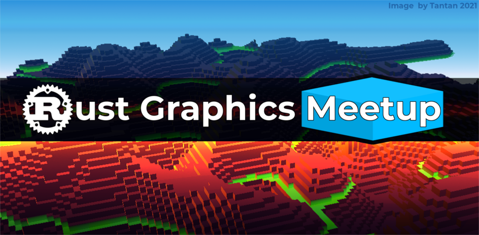

# The Rust Graphics Meetup

The Rust Graphics Meetup is a place where formal talks can be given about the state of graphics work in the Rust Language.

To attend the meetup, you can watch it [live on Twitch](https://www.twitch.tv/rustgamedev), and join in on the live discussion in the [Rust Gamedev Discord](https://discord.gg/yNtPTb2).

## Meetup 1: [October 2nd, 2021 @ 16:00 GMT](https://everytimezone.com/s/639e42bc)

### gfx-rs lessons learned - @kvark

gfx-rs survived Rust stabilization. It survived the coming of DX12 and Vulkan. But now, the repository is in maintenance mode. This foundational project was used in many libraries and application across the Rust graphics landscape (ggez, Amethyst, Veloren, and wgpu, to name a few). What tales can the elder graphics library tell the future generations?

### rend3 Architecture: Efficient, Customizable Rendering - @cwfitzgerald

This talk will go into how rend3 deals with the conflicting requirements of ease of use, customizability, and efficiency. rend3 strikes a balance between all of these requirements through careful scope reduction, ubiquitous defaults, and optimized use of data structures.

### Blub - Interactive GPU fluid solver - @wumpf

A short tour into a wgpu powered APIC fluid solver. After a short demonstration, we'll explore how the base algorithm works and talk about some selected details of the implementation.
